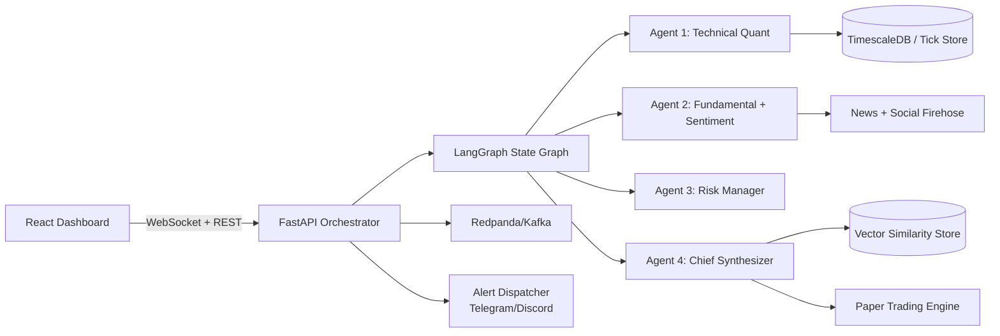

# Kubera — Institutional Multi-Agent Autonomous Trading Dashboard

Institutional-grade autonomous market intelligence stack with:

- **FastAPI backend** with **LangGraph** multi-agent orchestration
- **React dashboard** with realtime **WebSocket** streaming + Lightweight Charts
- **Dynamic ticker workflows** with Kafka-topic provisioning support
- **Continuous vectorized backtesting** and Bayesian win-probability
- **Paper trading engine** + Discord/Telegram realtime signal alerts

---

## Architecture Diagram



---

## Prerequisites

- Python 3.11+
- Node.js 20+
- npm 10+
- Docker + Docker Compose (recommended for full stack infra)

---

## Local Setup

### 1) Infra + Backend (Docker)

```bash
docker compose up --build
```

Services:

- Backend: `http://localhost:8000`
- Redpanda/Kafka: `localhost:9092`
- TimescaleDB: `localhost:5432`

### 2) Frontend (local)

```bash
cd app/frontend
npm ci
npm run dev
```

Frontend runs at `http://localhost:5173`.

---

## Environment Variables

### Backend

- `CORS_ORIGINS` (default `http://localhost:5173`)
- `CORS_ALLOW_CREDENTIALS` (default `false`; use `true` only with explicit non-wildcard origins)
- `DASHBOARD_CACHE_TTL_SECONDS` (default `45`)
- `DASHBOARD_CACHE_MAX_ITEMS` (default `256`)
- `KAFKA_BOOTSTRAP_SERVERS` (default `localhost:9092`)
- `KAFKA_TOPIC_PARTITIONS` (default `3`)
- `KAFKA_TOPIC_REPLICATION_FACTOR` (default `1`)
- `WS_STREAM_INTERVAL_SECONDS` (default `5`)
- `MONGO_URL` *(optional)*
- `DB_NAME` *(optional)*
- `TELEGRAM_BOT_TOKEN` *(optional for push alerts)*
- `TELEGRAM_CHAT_ID` *(optional for push alerts)*
- `DISCORD_WEBHOOK_URL` *(optional for push alerts)*
- `OPENAI_API_KEY` *(optional, reserved for future LLM extensions)*
- `PINECONE_API_KEY` *(optional, reserved for external vector-db integration)*

### Frontend

- `VITE_BACKEND_URL` (default: `http://localhost:8000` in dev, current origin in production)

Use the shipped templates as a starting point:

- `app/backend/.env.example`
- `app/frontend/.env.example`

---

## API Endpoints

Base URL: `http://localhost:8000/api`

### Health

- `GET /health/live`
- `GET /health/ready`

### Dashboard + MAS

- `GET /dashboard/{symbol}`
  - Query: `news_limit=5..100`, `force_refresh=true|false`
  - Returns:
    - market candles + overlays
    - technical/sentiment/risk/synthesizer outputs
    - `paper_trading` summary
    - explainability `brain_log`
    - cache metadata

- `POST /dashboard/predictions/resolve`
  - Body:
    ```json
    { "prediction_id": "p_1", "exit_price": 3120.5 }
    ```

### Dynamic Tickers

- `POST /subscriptions/{symbol}`  
  Creates/returns dynamic workflow + Kafka topic mapping.

- `GET /subscriptions`  
  Lists active dynamic ticker workflows.

### Paper Trading

- `GET /paper-trading/{symbol}`

### Market Data

- `GET /market/nse/{symbol}`
- `GET /market/nse/raw?api_path=/api/allIndices`
- `GET /market/bse/{stock_query}`
- `GET /news/{stock_query}?limit=20`

### Realtime Stream

- `WS /ws/dashboard/{symbol}?news_limit=25`

---

## Continuous Backtesting Mathematics

1. **Confluence detection**  
   Chief Synthesizer consumes:
   - technical state (trend, RSI, MACD, Bollinger, support/resistance/order blocks)
   - sentiment state (`-100..+100`)
   - risk state (VaR, ATR, RR, veto)

2. **Vectorization**  
   Current setup is encoded into a dense feature vector:
   - normalized RSI
   - MACD/signal pair
   - normalized sentiment
   - volatility
   - normalized RR
   - trend one-hot flags

3. **Similarity retrieval**  
   Retrieve top-k nearest historical setup vectors (k=500 max).

4. **Bayesian win probability**  
   With Beta(1,1) prior and `wins` successful outcomes from `total` matches:

   `P(win) = (wins + 1) / (total + 2)`

   Output percentage = `P(win) * 100`.

5. **Risk-aware final signal**  
   - Risk manager enforces SL/TP and RR constraints.
   - If RR < 1:2, risk veto forces `HOLD`.
   - In degraded-news mode, confidence is reduced.

---

## Development Validation

Backend:

```bash
cd app/backend
python -m compileall .
```

Frontend:

```bash
cd app/frontend
npm run lint
npm run build
```
